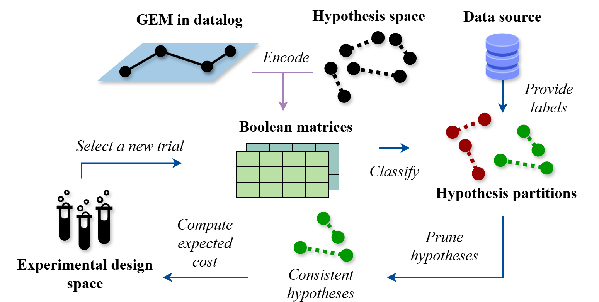
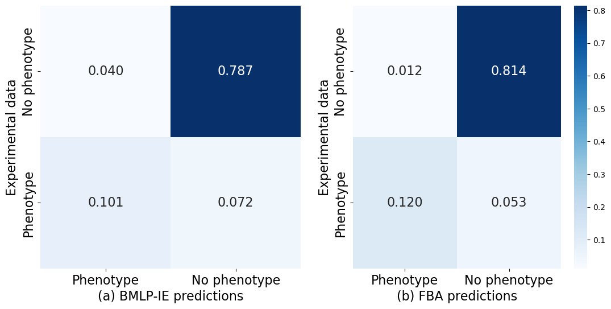
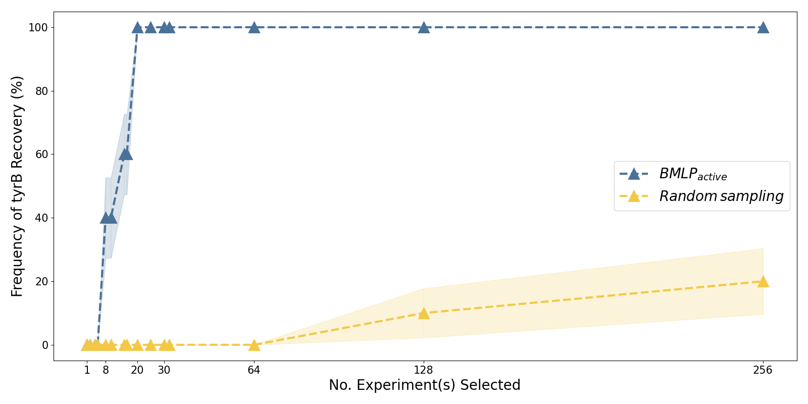

# Boolean matrix logic programming for active learning of gene functions in genome-scale metabolic network models

This repository contains the official experiment data of [Boolean matrix logic programming for active learning of gene functions in genome-scale metabolic network models](https://arxiv.org/abs/2405.06724). 

## Framework

Our new system $BMLP_{active}$ is based on a our new approach, Boolean Matrix Logic Programming (BMLP), in SWI-Prolog. 
$BMLP_{active}$ aims to explore the genomic hypothesis space by guiding informative experimentation through active learning. 
And it uses an interpretable and logical representation. $BMLP_{active}$ enables rapid optimisation of metabolic models.



$BMLP_{active}$ encodes the genome-scale metabolic network model (GEM) iML1515 and simulates the auxotrophic mutant experiment outcomes. It actively consults a data source to request ground truth labels that minimise the expected experimental cost based on a user-provided cost function when pruning hypotheses. The underlying BMLP iteratively refutes gene function hypotheses inconsistent with labelled training examples.

## Results

### Simulation accuracy

We compared with flux-balance analysis (FBA) results of iML1515. 
Our logic-based simulation approach achieves phenotypic
prediction accuracy 88.7% (FBA 93.4%).



Simulated phenotypic classifications are included in experiments/iML1515/sim_acc.

### Simulation runtime

We have demonstrated that the general-purpose Prolog interpreter SWI-Prolog can be augmented with our BMLP approach for faster phenotypic simulations given logically encoded metabolic network models.
There is a 170 times improvement in simulation time via our BMLP approach compared to base SWI-Prolog.

Runtime experiment results:
/src/experiments/iML1515/runtime

### Active learning cost reduction

We consider the experimental resource cost and the number of experiments as main factors to optimise. These two costs are related since the number of experiments generally is the main driver of experimental cost. 


BMLP_{active}$ reduces 90% of the cost used by random experiment sampling when converging to the correct gene function hypothesis. 

Active learning experiment results:
/src/experiments/iML1515/abduction/output/gene_function_learning

### Active learning sample complexity reduction

$BMLP_{active}$ can successfully learn the interaction between a gene pair with fewer training examples than random experimentation, overcoming the increase in experimental design space. 



$BMLP_{active}$ provides higher information gain from each experiment and can guarantee recovery with as few as 20 experiments. 
This is a significant reduction in the number of experimental data needed for learning.

Active learning experiment results:
/src/experiments/iML1515/abduction/output/isoenz_learning

## Citation

```commandline
@misc{ai2024boolean,
      title={Boolean matrix logic programming for active learning of gene functions in genome-scale metabolic network models}, 
      author={Lun Ai and Stephen H. Muggleton and Shi-Shun Liang and Geoff S. Baldwin},
      year={2024},
      eprint={2405.06724},
      archivePrefix={arXiv},
      primaryClass={q-bio.MN}
}
```

## License [](https://opensource.org/licenses/MIT)

Distributed under the MIT License. See LICENSE.txt for more information.

## Contact
[Dr. Lun Ai](https://lai1997.github.io/) (corresponding author)

Department of Computing

Imperial College London

Address: 180 Queen’s Gate, SW7 2BZ London, UK

Email: lun.ai15@imperial.ac.uk